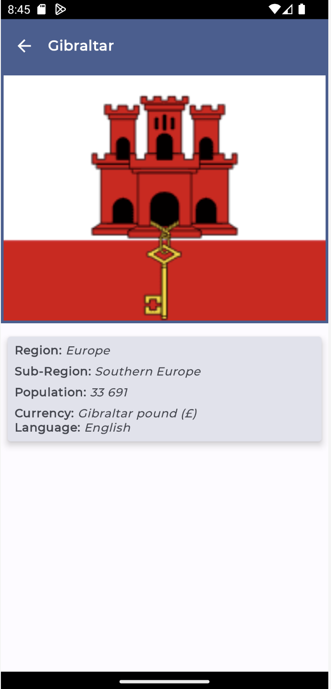

A simple app to hit the European Country List API and show a list of european countries, that shows details when items on the list item is tapped and implement MVI architecture using Dagger Hilt, Retrofit, Coroutines, Flows, Jetpack Compose and Navigation Component.

API used - https://restcountries.com/

API Documentation: https://restcountries.com/

<br>
<p align="center">
    
    
</p>
<br>

## This Project showcases:
1. MVI architecture.
2. View Model.
3. Unit test cases.
4. Retrofit.
5. Coil.
6. Navigation.
7. Jetpack Compose.
8. Kotlin Coroutines.
9. Kotlin State Flows.
10. Mockito.
11. Mockk.
    <br>


## The app has following packages:
1. **data**: This package is responsible for providing data to the application.
2. **domain**: This layer has use case and business logic.
3. **presentation**: This package contains user interface and view model
4. **di**: In this package dagger hilt dependancies documented.
   <br>

## If you see java 11 error then do following steps
1. **Go to Files**
2. **Settings**
4. **Build,Execution,Deployment**
5. **Build Tool**
6. **Select Gradle JDK to Java 11 OR whatever specified in app gradle file**
   <br>

## License
```
   Copyright (C) 2022 Mayuresh Deshmukh

   Licensed under the Apache License, Version 2.0 (the "License");
   you may not use this file except in compliance with the License.
   You may obtain a copy of the License at

       http://www.apache.org/licenses/LICENSE-2.0

   Unless required by applicable law or agreed to in writing, software
   distributed under the License is distributed on an "AS IS" BASIS,
   WITHOUT WARRANTIES OR CONDITIONS OF ANY KIND, either express or implied.
   See the License for the specific language governing permissions and
   limitations under the License.
